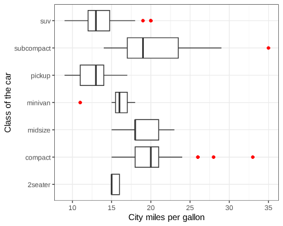

```{r setup, include=FALSE}
knitr::opts_chunk$set(echo = TRUE)
library(tidyverse)
```

## Question 1 (3 points, 1 each per subproblem)

In this section, you will create a git repository for your homework


### Setting up git

Open your terminal and run the below command 

`git init`

This initializes a local git repository on your homework project.

The `config` subcommand also lets you retrieve settings. Use `git config` with
the `get` option (recall: how are *optional* arguments passed to the command
line arguments) to retrieve your `user.name` and `user.email`. You can also run the command `git config` to see the usage of the command.

Set your name and email id using the config subcommand.

Check lecture notes: https://github.com/jravi123/stats306-w24/blob/master/lectures/lecture01.Rmd

Then copy and paste the config subcommand you ran to get and set user.name and user.email and the output from the terminal in the block below

```
git config --global user.name "weipeng"
git config --global user.email "weipeng@umich.edu"
```


### Commiting to your local repository

By this point you have made some changes to this hw01 file. Save the file.

Go to the *Terminal* and type `git status`. What is this telling you?

> This tells the current status of this repository: we are on branch master with no commits yet and nothing to commit. 

Use `git add hw01.Rmd` to place your changes in the staging area. Type `git status` again
to see what happened.

Right now, your homework is only "staged". Next, commit it with 

`git commit -m "A COMMIT MESSAGE"`

What was the commit ID of your changes?

```
2149404782c2271ce4a0984c5f89900c2589c037
```

### Using the log

Every commit in git gets its own identifier and log message. Using the `git log`
command you can see the entire log. Since this is quite long, it will be
"paginated". You can scroll up and down using arrow keys or the space bar to
move pages. Hit 'q' to quit.

For the most recent commit, fill out the following information:

* Commit id: 2149404782c2271ce4a0984c5f89900c2589c037
* Author: weipeng <weipeng@umich.edu>
* Date: Sat Jan 27 03:46:36 2024 +0000
* Message: initial commit

Make sure to save this file and use `git add` and `git commit` to periodically save your changes.


## Question 2 (3 points)

### Keeping code DRY (1 point)

A fundamental principle of good computer programming is avoiding repetition of
code. The acronym DRY stands for Don't Repeat Yourself. Using *variables*, clean
up the code below to avoid repetition.

```{r}
# A circle with diameter 7 has a circumference of
r = 7 / 2
h = 16
circumf = r * pi
area = r * r * pi
vol = r * r * pi * h

cat(
"A circle with diameter 7 has a circumference of", circumf, "
A circle with diameter 7 has an area of", area, "
A cylinder, with a face diameter of 7 and height of 16, has a volume of", vol, "\n")
```

### Mean and Variance (2 points)

For all the coding questions, you need to add the 'r' code block and complete your answers.

The sample mean is defined as:

$$ \bar X_n = \frac{1}{n} \sum_{i = 1}^n X_i$$

and the sample variance is defined as
$$ \hat \sigma^2 = \frac{1}{n - 1} \sum_{i=1}^n (X_i - \bar X_n)^2$$

Using *vectorized* computations, compute the sample mean and sample variance of
the `displ` column of the `mpg` data set. Do not use the functions `mean` or
`var`. You may use `length`, `nrow` and/or `sum`. 

```{r}
displ = mpg$displ # get displ column
sample_mean = sum(displ) / length(displ)
sample_var = sum((displ - sample_mean)^2) / (length(displ) - 1)
cat("Sample Mean:", sample_mean, "\nSample Variance:", sample_var, "\n")
```

## Question 3 (4 points)

### Starwars Characters (1 points)

Investigate the data set `starwars`. Answer the following

* How many characters are listed?
```{r, echo = FALSE}
cat("There are", nrow(starwars), "characters listed in the dataset.")
```
* What kind of data is the `species` column?
```{r, echo = FALSE}
cat("The species column contains", class(starwars$species), "vectors (strings).")
```
* Explain what the value `NA` means in the `hair_color` column.
```{r, echo = FALSE}
cat("NA, which stands for \"not available\", means that the data in a column is not available or undefined. In this case, if the Star Wars character is not capable of having hair, such as a C-3PO or R2-D2, then their hair color will be NA.")
```
* How many characters are from Tatooine?
```{r, echo = FALSE}
valid_homeworld <- starwars$homeworld[!is.na(starwars$homeworld)]
cat("There are", sum(valid_homeworld == "Tatooine"),"characters who come from Tatooine.\n")
```
* For humans, what is the average (mean) age?
```{r, echo = FALSE}
humans <- starwars$species == "Human"

cat("The average age of humans is", na.omit(starwars$birth_year[humans]) |> mean(), "years.")
```

### Height and Mass (1 points)

Create a scatter plot of the columns `height` and `mass` from the `starwars`
data set. What jumps out from the plot? Do a little investigation to find out
about that point.

```{r, echo = FALSE}
data(starwars)
ggplot(starwars, aes(x = height, y = mass)) +
  geom_point() +
  labs(title = "Scatter Plot of Height vs. Mass",
       x = "Height",
       y = "Mass")

m = starwars$mass[starwars$mass > 1000]
```

```
The outlier seen in the scatterplot is attributed to Jabba Desilijic Tiure, more commonly known as Jabba the Hut, with a mass of 1358.
```

### Challenge problem (2 points)
Each problem set will feature one or two questions that go a bit beyond what we have covered in lab and lecture. The goal of these is for you to learn how to use online resources (R's help, Google, Stack Overflow, etc.) to solve programming challenges that you have not encountered before. This is an important skill that you will use constantly as a data scientist in the real world.

Load the mpg data set, and use it to reproduce the following horizontal box and whisker plot that shows the distribution of city miles per gallon for each distinct value you see in the class column. Highlight the outliers in red. 



```{r}

if (!requireNamespace("ggplot2", quietly = TRUE)) {
  install.packages("ggplot2")
}
library(ggplot2)
data(mpg)

# Set the theme to white background
theme_set(theme_minimal())

# Create a boxplot with outliers highlighted in red
ggplot(mpg, aes(y = class, x = hwy)) +
  geom_boxplot(outlier.colour = "red") +
  labs(x = "City Miles per Gallon",
       y = "Class of the Car")
```

